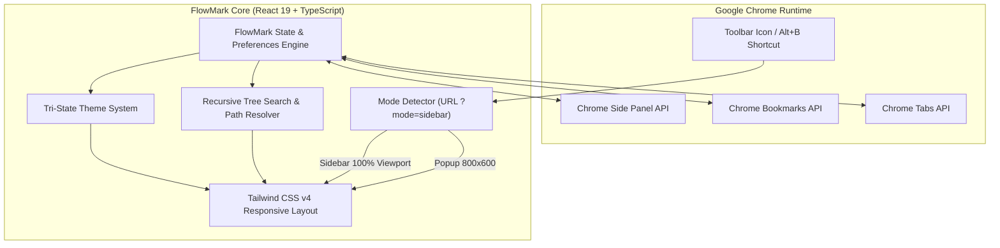

# ⚡ FlowMark

<div align="center">

**A fast, modern bookmark manager and native Side Panel replacement for Google Chrome.**

[](https://developer.chrome.com/docs/extensions/mv3/intro/)
[](https://react.dev/)
[](https://www.typescriptlang.org/)
[](https://vitejs.dev/)
[](https://tailwindcss.com/)
[](LICENSE)

[Features](#-key-features) • [Architecture](#-architecture) • [Keyboard Shortcuts](#-keyboard-shortcuts) • [Installation](#-installation) • [Development](#-development) • [Permissions](#-permissions--privacy)

</div>

---

## 📖 Overview

**FlowMark** replaces Chrome's default bookmark interface with a unified, high-performance command-center experience. Designed for keyboard-first efficiency and visual clarity, FlowMark allows you to search across thousands of nested bookmarks instantly, manage folders with breadcrumb navigation, capture active tabs in one click, and seamlessly toggle between a compact floating popup and a full-height Chrome Side Panel.


---

## ✨ Key Features

### 🚀 Dual-Mode Interface (Popup & Native Side Panel)
- **Floating Popup Mode:** Quick, centered 800×600 popup for rapid lookups and quick saves.
- **Side Panel Mode:** Pin FlowMark alongside your active tab in Chrome's native Side Panel with 100% responsive full-height layout.
- **Dynamic Action Routing:** Switch your default launch mode in Settings—FlowMark dynamically reconfigures Chrome's action click behavior.

### 🔍 Instant Deep Search & Path Badges
- **Recursive Flattening:** Search across deeply nested folders instantly by title or URL query.
- **Location Breadcrumb Badges:** Search results display the exact folder hierarchy path badge for every match.
- **Folder-First Sorting:** Folders are grouped first and sorted alphabetically for natural navigation.

### 📂 Interactive Folder Breadcrumbs
- Deeply traverse multi-level folder trees without losing context.
- Clickable breadcrumb trail lets you jump back to any ancestor directory in one click.
- Automatic UI synchronization when folders are modified or reorganized.

### ⚡ One-Click Active Tab Capture
- Automatically detects the current active tab title and URL.
- Quickly save the page to your current directory or pick from a nested folder selector dropdown.
- Gracefully handles restricted internal browser pages (`chrome://`).

### ⌨️ Comprehensive Keyboard Control
- **`Alt+B`**: Instant hotkey to launch FlowMark from anywhere in Chrome.
- **`↑` / `↓`**: Navigate smoothly through items.
- **`Enter`**: Open selected bookmark or drill down into the selected folder.
- **`Esc`**: Clear active search query $\rightarrow$ ascend one folder level $\rightarrow$ dismiss modal dialogs.

### 🎨 Tri-State Theme & Layout Engine
- **Dark Mode, Light Mode, & System Default:** Automatically matches your operating system theme via real-time `prefers-color-scheme` listeners.
- **Density Toggle:** Switch between Standard and Compact list density.
- **Link Target Control:** Choose whether bookmarks open in a new tab or update your existing tab.

---

## ⌨️ Keyboard Shortcuts

| Shortcut | Context | Action |
| :--- | :--- | :--- |
| <kbd>Alt</kbd> + <kbd>B</kbd> | Global (Chrome) | Open FlowMark (Popup or Side Panel) |
| <kbd>↑</kbd> / <kbd>↓</kbd> | List Navigation | Move selection up / down |
| <kbd>Enter</kbd> | List Item Selected | Open bookmark URL or enter folder |
| <kbd>Esc</kbd> | With Search Active | Clear search query and return to folder view |
| <kbd>Esc</kbd> | Inside Folder | Ascend one directory level (Go back) |
| <kbd>Esc</kbd> | Modal / Menu Open | Close active dialog or create dropdown |

---

## 🏗️ Architecture

FlowMark is engineered as a lightweight, zero-latency Chrome Extension built on Manifest V3.



### Component Structure

```text
FlowMark
├── manifest.json              # Manifest V3 (Permissions, Side Panel, Commands, Action)
├── vite.config.ts             # Vite bundler with @crxjs/vite-plugin & Tailwind v4
├── index.html                 # Single HTML entry point for both Popup & Sidebar
└── src/
    ├── main.tsx               # React 19 root bootstrap with StrictMode
    ├── index.css              # Tailwind v4 directives & custom scrollbars
    └── App.tsx                # Monolithic state engine, CRUD, modals, & UI views
```

---

## 📦 Tech Stack

| Layer | Technology | Purpose |
| :--- | :--- | :--- |
| **Runtime** | Chrome Extension Manifest V3 | Browser extension standard for security & performance |
| **Framework** | [React 19](https://react.dev/) | Declarative UI and component lifecycle management |
| **Language** | [TypeScript 5](https://www.typescriptlang.org/) | Type safety and Chrome API interface definitions |
| **Bundler** | [Vite 8](https://vitejs.dev/) + [@crxjs/vite-plugin](https://crxjs.dev/vite-plugin) | Sub-second HMR and optimized Chrome extension bundling |
| **Styling** | [Tailwind CSS v4](https://tailwindcss.com/) | Modern utility-first CSS engine powered by Lightning CSS |
| **Linting** | [ESLint 10](https://eslint.org/) | Code quality and React Hooks compliance |

---

## 🚀 Installation

1. **Clone the repository:**
   ```bash
   git clone https://github.com/DhruvTandon24/flowmark.git
   cd flowmark
   ```

2. **Install dependencies and build:**
   ```bash
   npm install
   npm run build
   ```

3. **Load in Chrome:**
   - Open Google Chrome and navigate to `chrome://extensions/`.
   - Enable **Developer mode** (toggle in the top-right corner).
   - Click **Load unpacked**.
   - Select the `dist` directory inside the FlowMark repository.
   - FlowMark is now installed and ready to use!

---

## 🛠️ Development

### Prerequisites
- Node.js (v18.0.0 or later)
- npm (v9.0.0 or later)

### Available Scripts

| Command | Description |
| :--- | :--- |
| `npm run dev` | Starts Vite development server with CRXJS Hot Module Replacement (HMR). |
| `npm run build` | Runs TypeScript type-checking (`tsc -b`) and produces an optimized production build in `dist/`. |
| `npm run lint` | Runs ESLint across the codebase. |
| `npm run preview` | Previews the built output. |

### Development Workflow with HMR

1. Run the dev server:
   ```bash
   npm run dev
   ```
2. In Chrome, load the `dist` folder via `chrome://extensions/`.
3. Changes made to `src/` will automatically trigger Fast Refresh in the extension popup and side panel.

---

## 🔒 Permissions & Privacy

FlowMark is designed with a strict privacy-first architecture. It contains **zero analytics, zero telemetry, and zero remote servers**. All preferences are stored locally in your browser.

| Permission | Reason for Requirement |
| :--- | :--- |
| `bookmarks` | Required to read, search, organize, create, edit, and delete bookmarks and folders in your browser. |
| `tabs` | Required to read the active tab's title/URL for "Save Current Tab" and dynamically update current tab navigation. |
| `sidePanel` | Required to render FlowMark in Chrome's native Side Panel alongside your browsing session. |

---

## 🤝 Contributing

Contributions, issues, and feature requests are welcome! Feel free to check the [issues page](https://github.com/DhruvTandon24/flowmark/issues) if you want to contribute.

1. Fork the repository
2. Create your feature branch (`git checkout -b feature/amazing-feature`)
3. Commit your changes (`git commit -m 'feat: add some amazing feature'`)
4. Push to the branch (`git push origin feature/amazing-feature`)
5. Open a Pull Request

---

## 📄 License

This project is licensed under the [MIT License](LICENSE).
